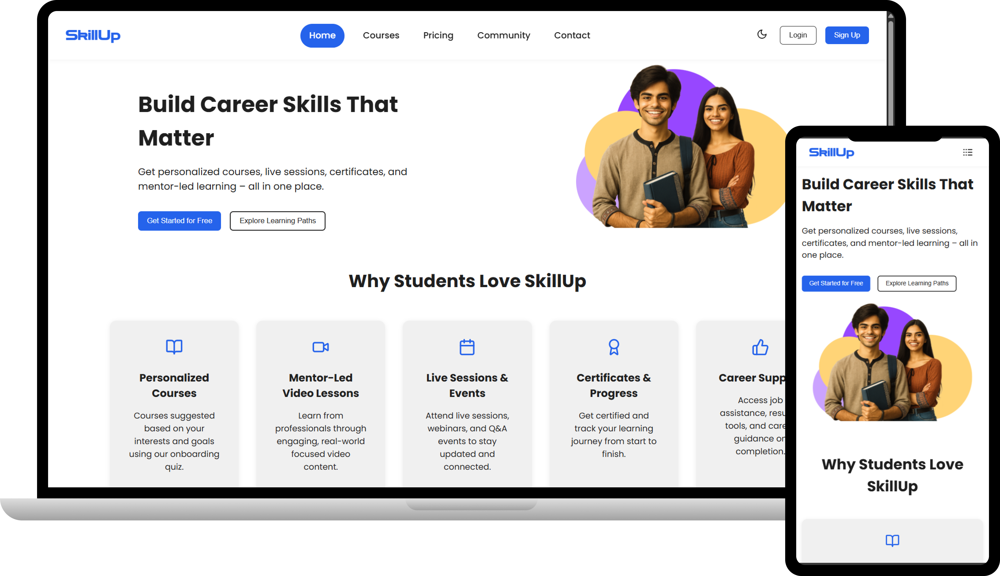
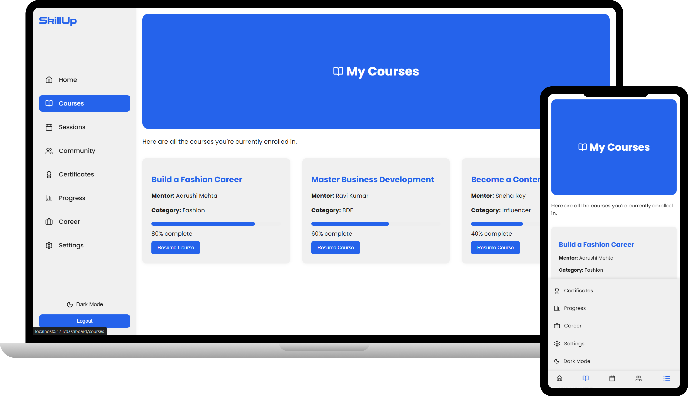
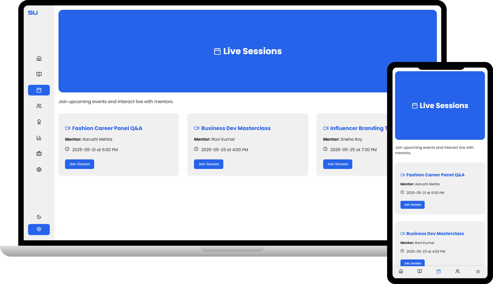
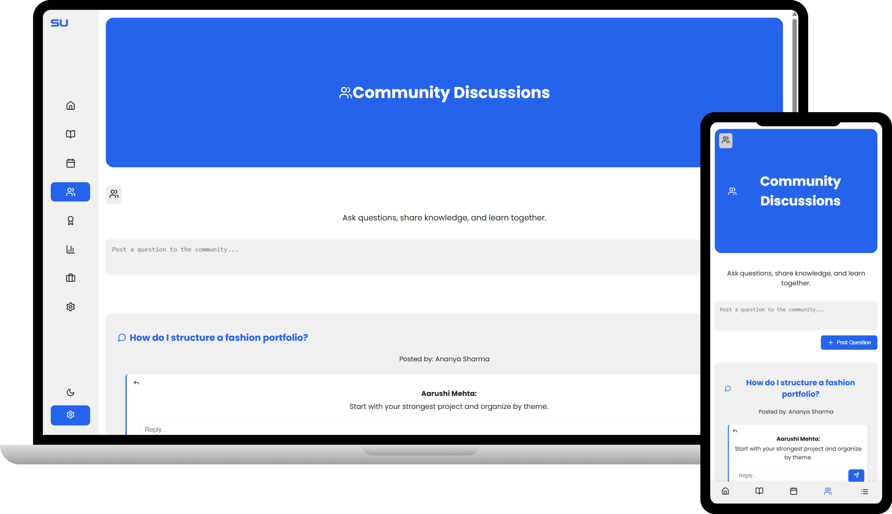
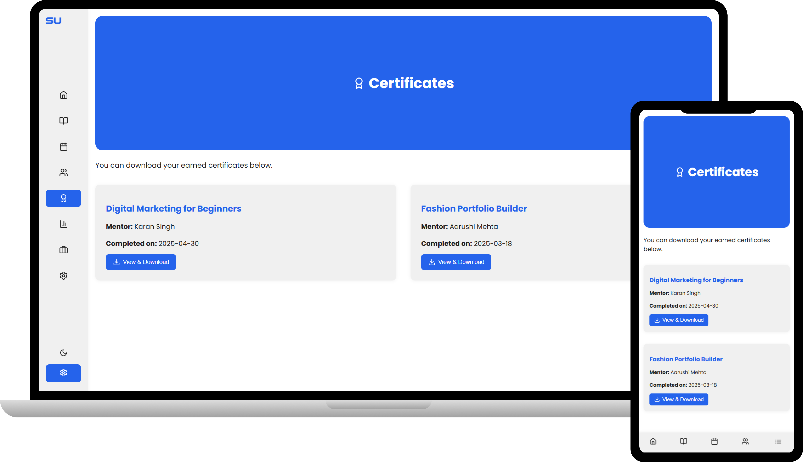
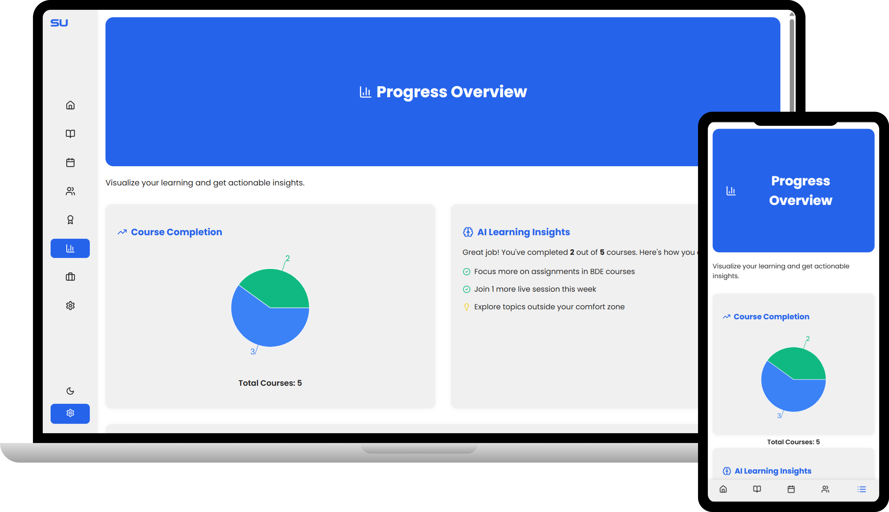
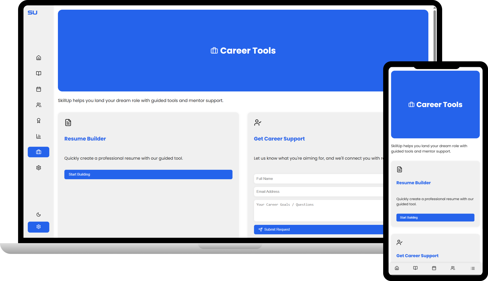
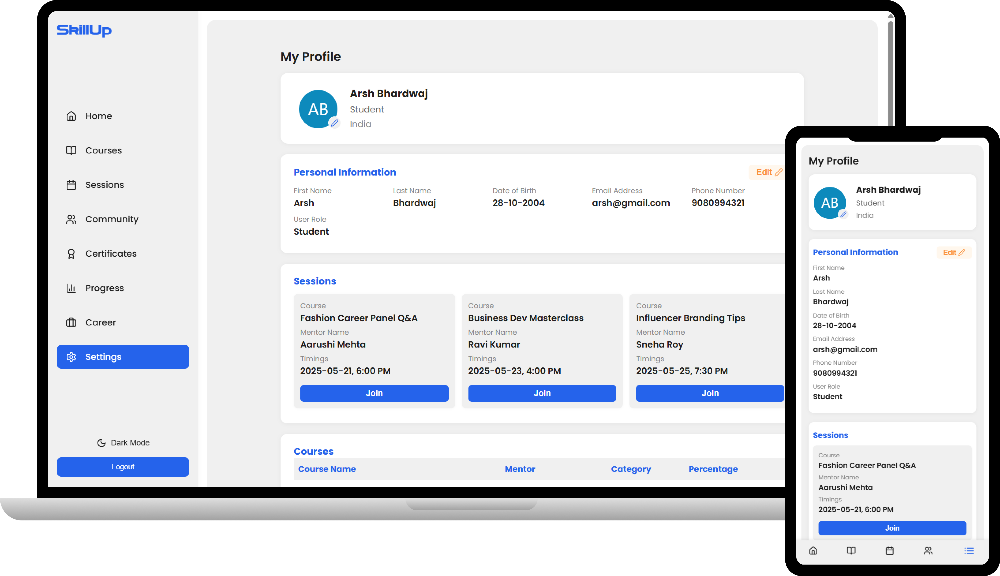

# 📚 EdTech Frontend

A modern, feature-rich educational technology platform frontend built with React and Vite, designed to provide seamless learning experiences with personalized courses, live sessions, and career development tools.

---

## 🚀 Project Overview

EdTech Frontend is a comprehensive learning management system interface that empowers students and professionals to:

- **Access Personalized Learning Paths** - Explore curated courses tailored to individual career goals
- **Participate in Live Sessions** - Engage with instructors and peers in real-time interactive classes
- **Earn Certifications** - Complete courses and receive industry-recognized certificates
- **Track Progress** - Monitor learning achievements with detailed analytics and performance metrics
- **Build Career Skills** - Access specialized career tools and mentor-led guidance
- **Connect with Community** - Collaborate and network with fellow learners

This platform targets students, career changers, and professionals seeking structured, mentor-driven online education with a focus on practical skill development and career advancement.

---

## 🖼 UI Preview

> Below are some preview screenshots of the EdTech platform interface.

### Home Page


### Courses Page


### Pricing Page


### Community Page


### Contact Page


### Authentication Pages

**Login Page**  


**Sign Up Page**  


---

## 📊 Dashboard UI Preview

> Screens showcasing the authenticated user dashboard and learning tools.

### Dashboard Home


### My Courses


### Live Sessions


### Community


### Certificates


### Progress Analytics


### Career Tools


### Settings


---

## ✨ Key Features

### Core Functionality
- **Responsive User Interface** - Optimized for desktop, tablet, and mobile devices
- **Modular Component Architecture** - Reusable, maintainable components built with best practices
- **Smooth Page Navigation** - Multi-page application with React Router for seamless routing
- **Advanced Animations** - GSAP-powered fade-in effects and Framer Motion transitions
- **Theme Context** - Light/dark mode support with React Context API

### User Experience Features
- **Hero Section** - Engaging landing page with typewriter animations
- **Interactive Navigation** - Responsive navbar with bottom navigation for mobile
- **Progress Analytics** - Visual charts and metrics using Recharts
- **Live Session Integration** - YouTube video embedding for course content
- **Dashboard Layout** - Dedicated user dashboard with multiple sections
- **Authentication Pages** - Login/Signup flows with protected routes

### UI/UX Enhancements
- **Custom Hooks** - Reusable animation logic with `useGsapFadeIn` hook
- **Icon Library** - Lucide React icons for consistent visual design
- **Typewriter Effects** - Dynamic text animations for engaging headings
- **Clean CSS** - Modular, component-scoped styling

---

## 🛠 Tech Stack

| Category | Technology |
|----------|-----------|
| **Frontend Framework** | React 19.1.0 |
| **Build Tool** | Vite 6.3.5 |
| **Routing** | React Router DOM 7.6.0 |
| **Animations** | GSAP 3.13.0, Framer Motion 12.11.4 |
| **Data Visualization** | Recharts 2.15.3 |
| **UI Components** | Lucide React 0.510.0 |
| **Effects & Text** | React Simple Typewriter 5.0.1 |
| **Video Integration** | React YouTube 10.1.0 |
| **Styling** | CSS3 (Modular/Component-scoped) |
| **Linting** | ESLint 9.25.0 |
| **Package Manager** | npm/yarn |

---

## 📂 Project Structure

```
edtech-frontend/
├── src/
│   ├── components/          # Reusable UI components
│   │   ├── Navbar.jsx       # Navigation bar component
│   │   ├── BottomNav.jsx    # Mobile bottom navigation
│   │   ├── HeroSection.jsx  # Landing page hero with animations
│   │   ├── CoreBenefits.jsx # Key platform features
│   │   ├── HowItWorks.jsx   # Platform workflow explanation
│   │   ├── Footer.jsx       # Footer component
│   │   └── RightSidebar.jsx # Sidebar navigation
│   │
│   ├── pages/               # Full page components
│   │   ├── Home.jsx         # Landing page
│   │   ├── LoginPage.jsx    # User login
│   │   ├── SignupPage.jsx   # User registration
│   │   ├── CoursePage.jsx   # Course listing & details
│   │   ├── MyCourses.jsx    # Enrolled courses
│   │   ├── LiveSessions.jsx # Live class directory
│   │   ├── LiveSessionRoom.jsx # Active session room
│   │   ├── Certificates.jsx # User certificates
│   │   ├── CareerTools.jsx  # Career development tools
│   │   ├── CommunityPage.jsx # Community forum
│   │   ├── Community.jsx    # Community listing
│   │   ├── ContactPage.jsx  # Contact form
│   │   ├── PricingPage.jsx  # Pricing tiers
│   │   ├── ProgressAnalytics.jsx # Learning analytics
│   │   ├── DashboardHome.jsx # User dashboard
│   │   ├── DashboardLayout.jsx # Dashboard wrapper
│   │   ├── SettingProfile.jsx # User profile settings
│   │   ├── Setting.jsx      # General settings
│   │   ├── AuthLayout.jsx   # Authentication layout
│   │   └── ProtectedRoute.jsx # Route protection wrapper
│   │
│   ├── context/             # React Context API state
│   │   └── ThemeContext.jsx # Theme management (light/dark)
│   │
│   ├── hooks/               # Custom React hooks
│   │   └── useGsapFadeIn.jsx # Animation hook for fade-in effects
│   │
│   ├── layout/              # Layout components
│   │   └── Layout.jsx       # Main app layout with navbar
│   │
│   ├── assets/              # Static assets
│   │   └── (images, SVGs, etc.)
│   │
│   ├── App.jsx              # Root application component
│   ├── main.jsx             # React DOM entry point
│   ├── App.css              # Global app styles
│   └── index.css            # Global styles
│
├── public/                  # Static public assets
├── vite.config.js           # Vite configuration
├── eslint.config.js         # ESLint rules
├── package.json             # Project dependencies & scripts
└── README.md                # This file
```

### Directory Details

- **components/** - Presentational, reusable components (Navbar, Footer, Hero sections)
- **pages/** - Full-page components representing different routes
- **context/** - Centralized state management using React Context
- **hooks/** - Custom hooks for shared logic (animations, animations)
- **layout/** - Layout wrapper components for consistent UI structure
- **assets/** - Images, SVGs, and other static media files

---

## ⚙️ Installation & Setup

### Prerequisites

- **Node.js** (v14 or higher recommended)
- **npm** or **yarn** package manager
- Git

### Local Development Setup

1. **Clone the Repository**
   ```bash
   git clone <repository-url>
   cd edtech-frontend
   ```

2. **Install Dependencies**
   ```bash
   npm install
   ```

3. **Start Development Server**
   ```bash
   npm run dev
   ```
   The application will be available at `http://localhost:5173`

4. **Access on Other Devices** (Network)
   - Vite is configured to allow access from other devices on your network
   - Use your machine's IP address: `http://<your-ip>:5173`

---

## 🔐 Demo Login Credentials

Use the following demo credentials to explore the authenticated dashboard UI:

- **Email:** arsh@gmail.com  
- **Password:** @rsh2004  

### Notes:
- This is a **frontend-only demo login**
- No real authentication or backend validation is implemented
- Credentials are used only for **UI navigation and dashboard preview**


---

## 📦 Available Scripts

| Script | Description |
|--------|-------------|
| `npm run dev` | Start Vite development server with HMR (Hot Module Reloading) |
| `npm run build` | Create optimized production build |
| `npm run preview` | Preview the production build locally |
| `npm run lint` | Run ESLint to check code quality |

---

## 🎯 Key Components & Features

### Animation System
- **GSAP Integration** - Powerful fade-in animations via `useGsapFadeIn` custom hook
- **Framer Motion** - Smooth transitions and interactive motion effects
- **Typewriter Effect** - Dynamic text typing animations on hero sections

### State Management
- **React Context API** - Theme management with light/dark mode support
- **Local Component State** - React hooks for component-level state

### Routing Architecture
- **React Router v7** - Dynamic routing with nested routes
- **Protected Routes** - Authentication-protected page access
- **Layout System** - Consistent layout wrappers (Main Layout, Dashboard Layout, Auth Layout)

### Data Visualization
- **Recharts** - Interactive charts for progress analytics
- **Visual Metrics** - Performance tracking and analytics display

---

## 🚀 Production Build

To create an optimized production build:

```bash
npm run build
```

This generates a `dist/` folder with minified and optimized assets ready for deployment.

To preview the production build:

```bash
npm run preview
```

---

## 🔧 Configuration

### Vite Configuration
The project uses Vite 6 with the following setup:
- **Fast Refresh** - Instant browser updates during development
- **Network Access** - Server accessible on `0.0.0.0:5173` for multi-device testing
- **React Plugin** - Optimized React Fast Refresh integration

### ESLint Configuration
Code quality and consistency are maintained through ESLint with rules for:
- React best practices
- React Hooks rules
- React Refresh compatibility

Run the linter:
```bash
npm run lint
```

---

## 📱 Responsive Design

The application is fully responsive and optimized for:
- **Desktop** - Full feature set with sidebar and comprehensive layouts
- **Tablet** - Adapted layouts with touch-friendly interactions
- **Mobile** - Bottom navigation, simplified layouts, and optimized components

---

## 🎨 Theme System

The application includes a theme context for managing light/dark modes:
- Toggle theme via `ThemeContext.jsx`
- Consistent theming across all components
- Easy to extend with additional theme options

---

## 🤝 Contributing

When adding new features or components:

1. **Component Structure** - Follow the established pattern in `components/` or `pages/`
2. **Styling** - Keep CSS modular and component-scoped
3. **Animations** - Use the `useGsapFadeIn` hook for consistency
4. **Code Quality** - Run `npm run lint` before committing
5. **Responsive Design** - Test on multiple screen sizes

---

## 📄 License

This project is open source and available under the MIT License.

---

## 🙋 Support

For questions, issues, or suggestions, please open an issue on the repository or contact the development team.

---

**Built with ❤️ using React, Vite, and modern web technologies**
